# Deepfake Detection

### A Full-Stack Deepfake Detection Application developed FastAPI, Tensorflow, OpenCV, React.js and Tailwind CSS

## To run this project locally:
#### Pre requisites: Python(>=3.10), Node.js(>=18.19)

* Clone this repository
```
git clone https://github.com/harshpx/deepfake-detection.git
cd deepfake-detection
```
* Setup python virtual environment and install dependencies
```
python3 -m venv ./venv
source ./venv/bin/activate
pip install -r requirements.txt
```
* Install frontend dependencies (present inside cilent directory)
```
cd client
npm install
```

* Go to parent directory (where app.py is located) and run the FastAPI server using:
```
uvicorn app:app --host 0.0.0.0 --port 8000 --reload
```
Now our FastAPI server must be running on localhost:8000 (make sure that your port 8000 is free before running previous command).

* Go to client directory and create another terminal (where package.json is located) and run the React App using:
```
npm run dev
```
Now our React App must be running on localhost:5173 (or on any port >5173 if it is not free).


## Project description
The main model is a **10 Layer Deep CNN Architecture**, which is optimized for effective image processing and classification, and specifically adapted to the deepfake detection task.

### Model Structure
* With more than 653k parameters and dropout as the only regularization method, the model was quite straightforward.
* The dropout rate in dense layers is set at 0.5, preventing overfitting by forcing neurons to learn independently. 50% of neurons in each batch or training example are randomly removed, creating a new neural network for each batch, and the average prediction is obtained.
* The initial few Convolution layers had a kernel size of 5 and 64 filters, followed by max-pooling, unlike later layers with fewer filters and a dilation rate of 2.
* The benefit of dilated convolutions is obvious: they produce a bigger field of reception. The dilation rate was maintained at its standard level. You'll see that our network is only dilated in the final three layers.
* We use a binary classification model, and the output is based on sigmoid activation.
* Input image size used is [224,224,3].
* The training accuracy achieved was <99.9% and the validation accuracy too achieved was <99% (Extremely accurate).

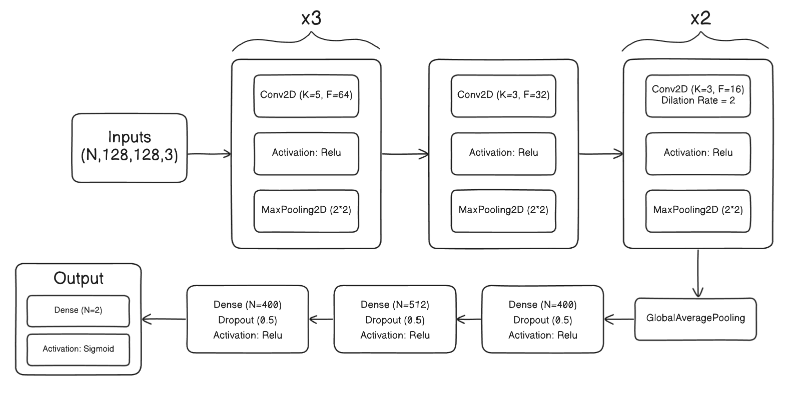


## Performance Analysis

* **Training Logs**
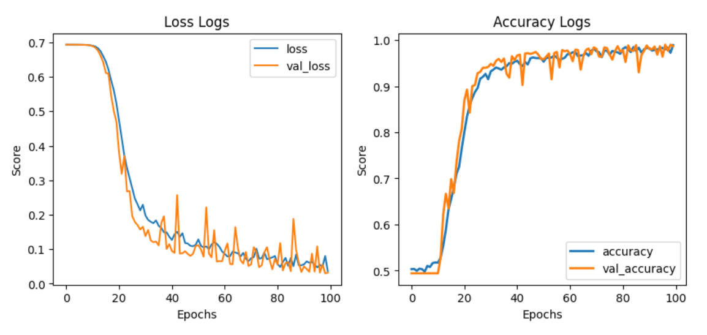

* **Evaluation Metrics: Accuracy, Precision, Recall**
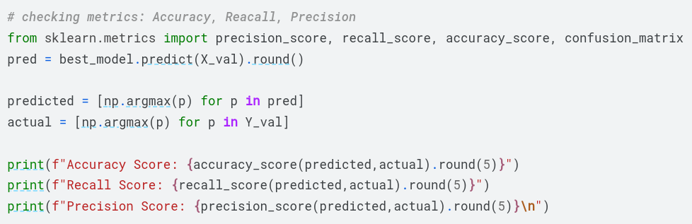
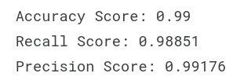

* **Confusion Matrix**
    * True Positive: 602
    * False Positive: 7
    * False Negative: 5
    * True Negative: 586
    <br/>
    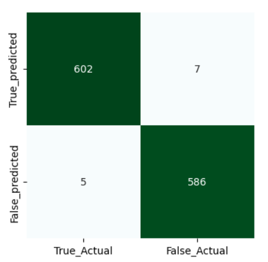


* **ROC-AUC curve**
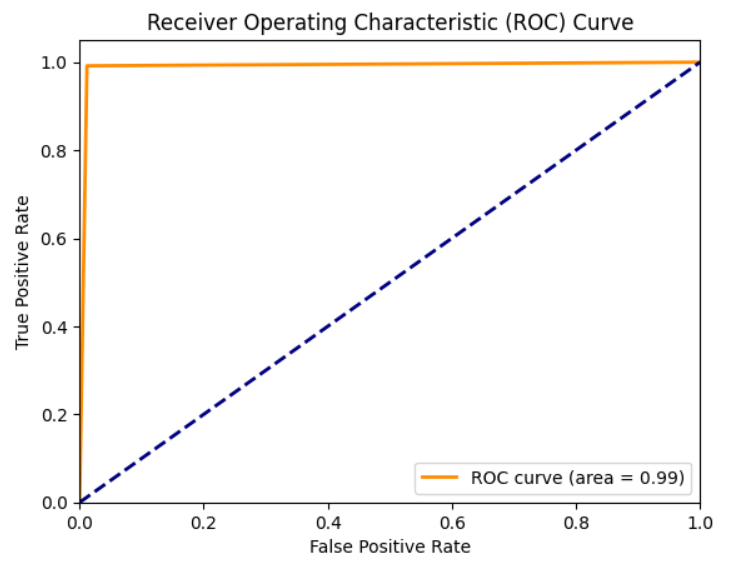


## Post-Training Pipeline
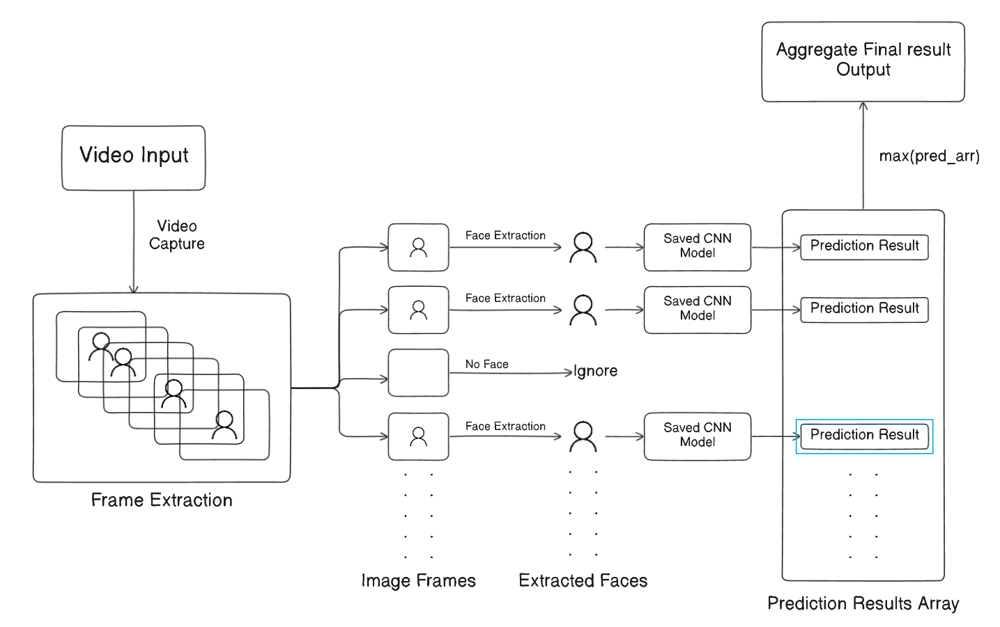

## Application Architecture (Client-Server)
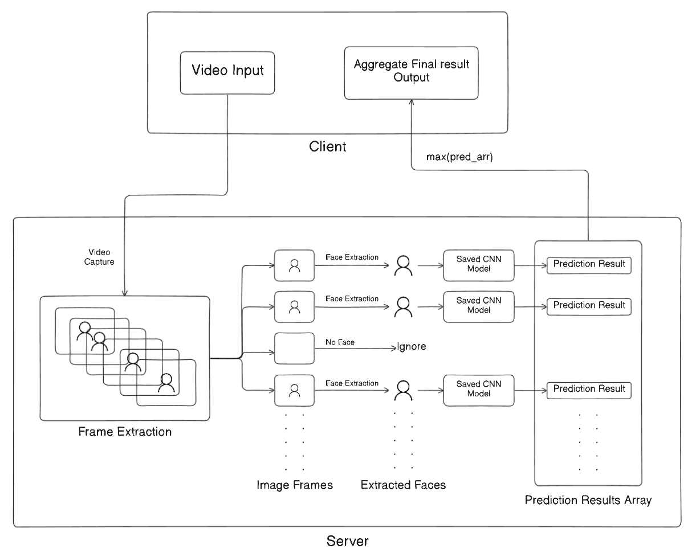


## Screenshots
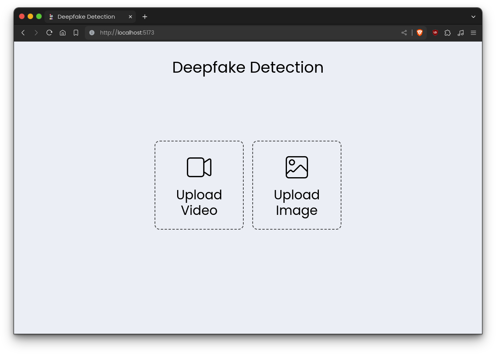
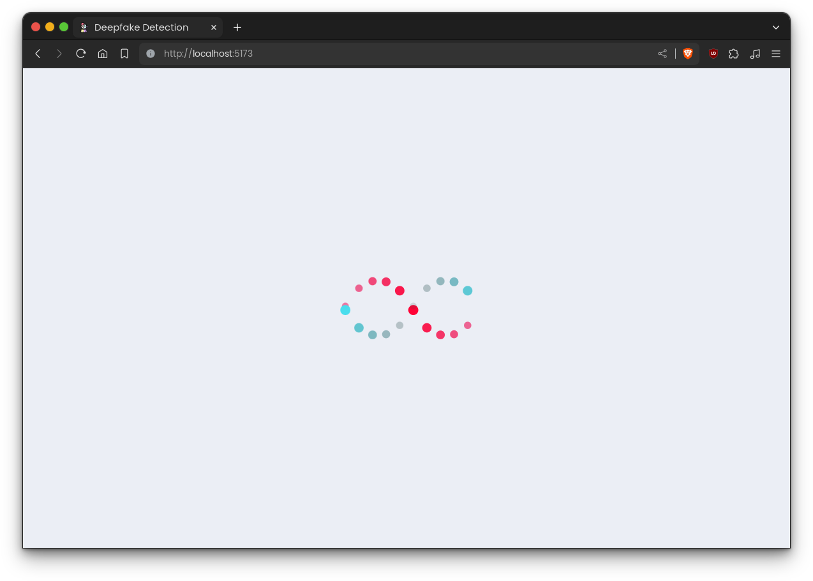
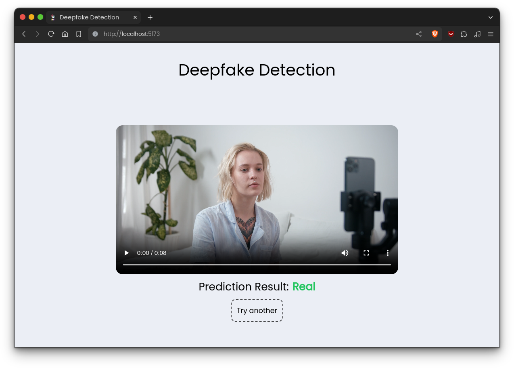

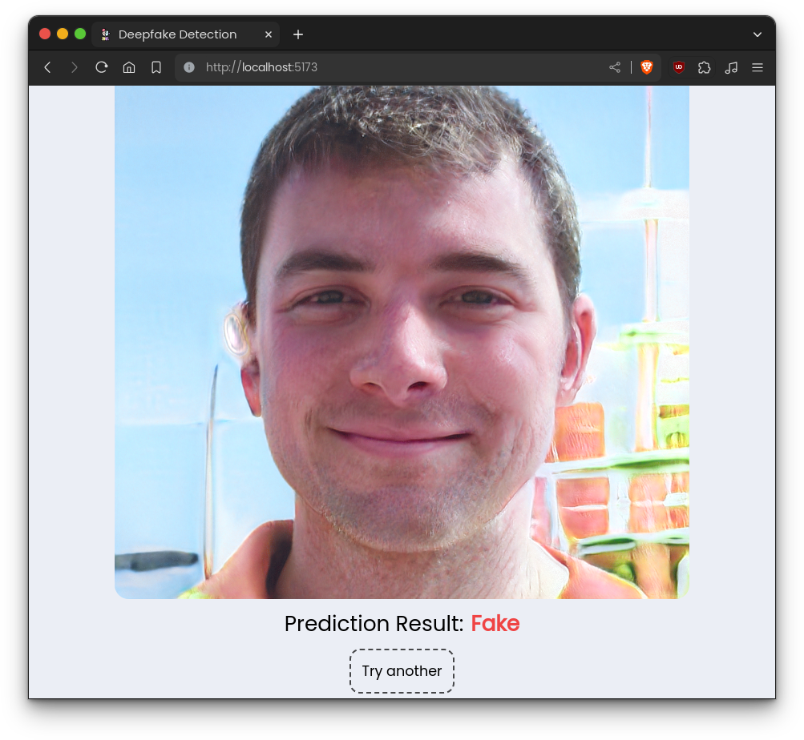